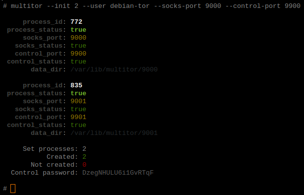

# multitor

## Releases

|            **STABLE RELEASE**            |           **TESTING RELEASE**            |
| :--------------------------------------: | :--------------------------------------: |
| []() | []() |
| []() | []() |
| [](https://travis-ci.org/trimstray/multitor) | [](https://travis-ci.org/trimstray/multitor) |

## Description

A tool that lets you **create multiple TOR** instances with a **load balancing** traffic between them. In addition, you can **view** previously running **TOR** processes and create a **new identity** for all or selected processes.

> The **multitor** has been completely rewritten on the basis of:
>
> - **Multi-TOR** project written by *Jai Seidl*: [Multi-TOR](https://github.com/jseidl/Multi-TOR)
> - original source is (*Sebastian Wain* project): [Distributed Scraping With Multiple Tor Circuits](http://blog.databigbang.com/distributed-scraping-with-multiple-tor-circuits/)

## Parameters

Provides the following options:

``````
  Usage:
    multitor <option|long-option>

  Examples:
    multitor --init 2 --user debian-tor --socks-port 9000 --control-port 9900
    multitor --show-id --socks-port 9000

  Options:
        --help                      show this message
        --debug                     displays information on the screen (debug mode)
    -i, --init <num>                init new tor processes
    -s, --show-id                   show specific tor process id
    -n, --new-id                    regenerate tor circuit
    -u, --user <string>             set the user (only with -i|--init)
        --socks-port <port_num|all> set socks port number
        --control-port <port_num>   set control port number
        --proxy                     set tor load balancer
``````

## Requirements

**<u>Multitor</u>** uses external utilities to be installed before running:

- [tor](https://www.torproject.org/)
- [netcat](http://netcat.sourceforge.net/)
- [haproxy](https://www.haproxy.org/)

## Install/uninstall

It's simple - for install:

```
./setup.sh install
```

For remove:

```
./setup.sh uninstall
```

> - symlink to `bin/multitor` is placed in `/usr/local/bin`
> - man page is placed in `/usr/local/man/man8`

## Use example

### Creating processes

Then an example of starting the tool:

``````
multitor --init 2 -u debian-tor --socks-port 9000 --control-port 9900
``````

Creates new **Tor** processes and specifies the number of processes to create:

- `--init 2`

Specifies the user from which new processes will be created (the user must exist in the system):

- `-u debian-tor`

Specifies the port number for **Tor** communication. Increased by 1 for each subsequent process:

- `--socks-port 9000`

Specifies the port number of the **Tor** process control. Increased by 1 for each subsequent process:

- `--control-port 9900`

### Reviewing processes

Examples of obtaining information about a given **Tor** process created by **multitor**:

```
multitor --show-id --socks-port 9000
```

We want to get information about a given **Tor** process:

- `--show-id`

> You can use the **all** value to display all processes.

Specifies the port number for communication. Allows you to find the process after this port number:

- `--socks-port 9000`

### New Tor identity

If there is a need to create a new identity:

```
multitor --new-id --socks-port 9000
```

We set up creating a new identity for **Tor** process:

- `--new-id`

> You can use the **all** value to regenerate identity for all processes.

Specifies the port number for communication. Allows you to find the process after this port number:

- `--socks-port 9000`

### Output example

So if We created 2 **Tor** processes by **multitor** example output will be given:



## Load balancing

**Multitor** uses HAProxy to create a local socks proxy server for all created **TOR** instances and distribute traffic between them. The default configuration is in `templates/haproxy-template.cfg`.

To run the load balancer you need to add the `--proxy` parameter to the command specified in the example.

```bash
multitor --init 2 -u debian-tor --socks-port 9000 --control-port 9900 --proxy
```

After launching, let's see the working processes:

```bash
netstat -tapn | grep LISTEN | grep "tor\|haproxy"
tcp        0      0 127.0.0.1:9000          0.0.0.0:*               LISTEN      25497/tor           
tcp        0      0 127.0.0.1:9001          0.0.0.0:*               LISTEN      25560/tor           
tcp        0      0 127.0.0.1:9900          0.0.0.0:*               LISTEN      25497/tor           
tcp        0      0 127.0.0.1:9901          0.0.0.0:*               LISTEN      25560/tor           
tcp        0      0 127.0.0.1:16379         0.0.0.0:*               LISTEN      25638/haproxy       
tcp        0      0 127.0.0.1:16380         0.0.0.0:*               LISTEN      25638/haproxy
```

HAProxy uses **16379** to communication, so all of your services to use the load balancer should have this port number.

In order to test the correctness of the setup, you can run the following command:

```bash
for i in $(seq 1 4) ; do echo -en "req ${i}: " ; curl -k --location --proxy socks5h://127.0.0.1:16379 http://ipinfo.io/ip ; done
req 1: 176.10.99.200
req 2: 185.220.101.29
req 3: 176.10.99.200
req 4: 185.220.101.29
```

> If you do not need a working haproxy at the moment and the processes of this service are still working, you can do one of many available commands to manage processes in GNU/Linux and kill them: `pkill -f haproxy`.

### HAProxy stats interface

If you want to view traffic statistics, go to http://127.0.0.1:16380/stats.

## Password authentication

**Multitor** uses password for authorization on the control port. The password is generated automatically and contains 18 random characters - it is displayed in the final report after the creation of new processes.

## Logging

After running the script, the `log/` directory is created and in it the following files with logs:

- `<script_name>.<date>.log` - all `_logger()` function calls are saved in it
- `stdout.log` - a standard output and errors from the `_init_cmd()` and other function are written in it

## Important

If you use this tool in other scripts where the output is saved everywhere, not on the screen, remember that you will not be able to use the generated password. I will correct this in the next version. If you do not use regenerate function of single or all **TOR** circuits with a password, you can safely restart the **multitor** which will do it for you.

## Limitations

- each **Tor** process needs a certain number of memory. If the number of processes is too big, the oldest one will be automatic killed by the system

## Contributing

See [CONTRIBUTING.md](CONTRIBUTING.md).

## Project architecture

    |-- LICENSE.md                 # GNU GENERAL PUBLIC LICENSE, Version 3, 29 June 2007
    |-- README.md                  # this simple documentation
    |-- CONTRIBUTING.md            # principles of project support
    |-- .gitignore                 # ignore untracked files
    |-- .travis.yml                # continuous integration with Travis CI
    |-- setup.sh                   # install multitor on the system
    |-- bin
        |-- multitor               # main script (init)
    |-- doc                        # includes documentation, images and manuals
        |-- man8
            |-- multitor.8         # man page for multitor
    |-- etc                        # contains configuration files
    |-- lib                        # libraries, external functions
    |-- log                        # contains logs, created after init
    |-- src                        # includes external project files
        |-- helpers                # contains core functions
        |-- import                 # appends the contents of the lib directory
        |-- __init__               # contains the __main__ function
        |-- settings               # contains multitor settings
    |-- templates                  # contains examples and template files
        |-- haproxy-template.cfg   # example of user config file

## License

GPLv3 : <http://www.gnu.org/licenses/>

**Free software, Yeah!**
